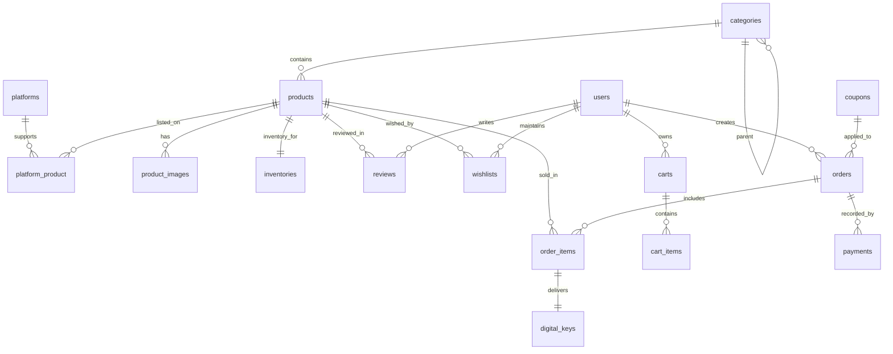
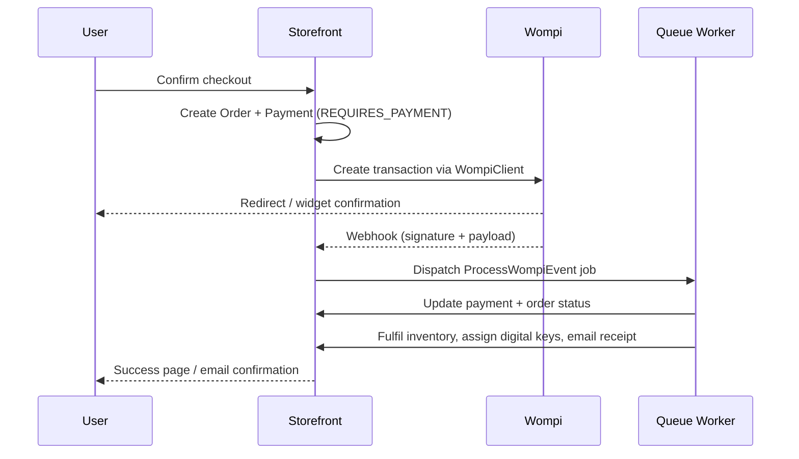

# GameStore

GameStore is a complete Laravel 11 ecommerce platform focused on selling physical and digital videogames. It ships with a containerised environment, authentication via Laravel Breeze, Redis-backed cache and queues, Horizon monitoring, Swagger documentation, automated tests, and end-to-end checkout integrated with Wompi (card and transfers) including webhook processing.

## Features

- Modern Laravel 11 stack with PHP 8.2, Redis cache/queues, Horizon, Mailhog and MySQL 8.
- Docker Compose environment (Nginx + PHP-FPM + Node 20 + Redis + Horizon + Mailhog) with handy `make` shortcuts.
- Authentication with email verification, password policies, rate limiting, and admin role gating.
- Videogame catalogue: categories, platforms, products (physical/digital), images, inventory, coupons, wishlists, reviews.
- Shopping cart with coupon engine, configurable VAT, checkout wizard, order management, PDF invoicing (Dompdf) and email notifications.
- Wompi integration encapsulated in `App\Services\Wompi\WompiClient`, webhook signature verification, idempotent processing jobs.
- Admin panel built with Blade and Tailwind for dashboards, CRUDs, digital key management, review moderation, CSV exports.
- Swagger/OpenAPI 3 docs served from `/docs` covering public storefront and admin API endpoints.
- Comprehensive test suite using Pest + PHPUnit with unit, feature, and API coverage (target ≥ 70%).

## Prerequisites

- Docker 27+
- Docker Compose v2
- Make (optional but recommended)

## Quick Start

```bash
cp .env.example .env                 # configure keys and Wompi sandbox credentials
make up                              # build containers and start the stack
docker compose exec app php artisan key:generate
docker compose exec app php artisan migrate --seed
```

Visit the following URLs once the stack is up:

- Storefront: http://localhost
- Admin panel: http://localhost/admin
- Swagger UI: http://localhost/docs
- Horizon dashboard: http://localhost/horizon
- Mailhog inbox: http://localhost:8025

Seeder credentials (created in later steps) provide admin/demo accounts for exploration.

## Services & Ports

| Service  | Image                | Port(s)      | Notes                                   |
|----------|----------------------|--------------|-----------------------------------------|
| app      | PHP-FPM 8.2          | —            | Runs Artisan, queue workers, tests      |
| web      | Nginx 1.27           | 8000 → 80    | Serves the Laravel application          |
| vite     | Node 20 (dev server) | 5173         | Hot module reload for Blade/Tailwind    |
| mysql    | MySQL 8.0            | 33060 → 3306 | Main database                           |
| redis    | Redis 7              | 6379         | Cache, queues, rate limiting            |
| horizon  | PHP-FPM (queue)      | —            | Horizon supervisor (enable via profile) |
| mailhog  | Mailhog 1.0          | 8025         | Catch-all SMTP for local email          |

## Make Commands

| Command          | Description                                      |
|------------------|--------------------------------------------------|
| `make up`        | Build images and start the full stack            |
| `make down`      | Stop and remove containers, networks, and volumes|
| `make restart`   | Rebuild and restart the stack                    |
| `make migrate`   | Run outstanding migrations                       |
| `make migrate-fresh` | Rebuild schema and seed demo data           |
| `make seed`      | Run migrations and seeders                       |
| `make test`      | Run the test suite in parallel                   |
| `make pest`      | Execute Pest directly                            |
| `make coverage`  | Generate test coverage report                    |
| `make cs-fix`    | Run PHP-CS-Fixer with project rules              |
| `make horizon`   | Start the Horizon worker profile                 |
| `make logs`      | Tail combined Docker logs                        |
| `make docs`      | Regenerate Swagger documentation via Artisan     |

## Environment

Key environment variables are defined in `.env.example`. Ensure Wompi sandbox keys, Mailhog sender, Redis cache, and VAT rate match your setup. Horizon queues use the `HORIZON_PREFIX` for consistent naming across environments.

## Documentation & Swagger

OpenAPI definitions live under `storage/app/openapi` (generated later). Use `make docs` after modifying routes or controllers to refresh the documentation. Swagger UI is exposed at `/docs`.

## Testing Strategy

- Pest + PHPUnit with `tests/Feature` and `tests/Unit`.
- API tests cover checkout flow (including fake webhook), inventory adjustments, coupon rules, and admin policies.
- Run `make test` to execute the full suite. Coverage reports are stored in `storage/app/coverage` and surfaced in CI.

## Continuous Integration

GitHub Actions workflows (added later) execute PHP-CS-Fixer linting, run the Pest suite, and ensure Vite compiles assets. Secrets required for CI are documented in `.github/workflows/README.md`.

## Diagrams

### Entity Relationship



### Payment Flow



## Project Structure Highlights

- `app/Services/Wompi` – API client, DTOs and signature helpers.
- `app/Http/Controllers/Storefront` – Public catalogue, cart, checkout.
- `app/Http/Controllers/Admin` – Admin dashboard and CRUD controllers.
- `app/Policies` – Authorization for admin-only features.
- `database/factories` and `database/seeders` – Rich demo data generation.
- `routes/web.php`, `routes/api.php`, `routes/admin.php` – Segregated route groups.
- `resources/views` – Tailwind powered Blade views for store and admin UI.

## Additional Notes

- Mailhog captures all outgoing emails; check `/storage/logs/laravel.log` for queue/webhook logs.
- Horizon metrics are namespaced by `HORIZON_PREFIX`.
- Digital keys can be imported via CSV from the admin panel.
- Remember to set a unique `APP_KEY` and secure passwords before deploying to production.
